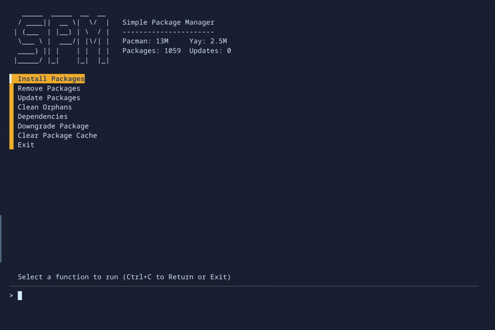

# SPM - Simple Package Manager



SPM is a Simple Package Manager for Arch-based Linux distributions.  

It provides an intuitive fzf interface for common package management tasks using `yay` and `pacman`.

## Features

### User-Friendly Interface
- Interactive menu-driven interface powered by `fzf`
- Multi-Select functionality for batch operations
- Real-time package information preview
- Recently installed and removed packages display

### System Management
- Comprehensive system update options
  - Quick update (auto-yes for yay and Flatpak)
  - Separate yay and Flatpak update options
  - Full update with review of all changes
- Intelligent package installation
  -Multi-Select
  - Search and install from official repositories and AUR
  - Display of package details, dependencies, files to install, and PKGBUILD (for AUR packages)
- Flexible package removal
  - Multi-Select
  - Multiple removal options (including dependencies and config files)
  - Preview of package info and installed files before removal

### Dependency Management
- Orphaned package cleanup with various options
- Advanced dependency exploration and analysis
  - Interactive exploration of package dependencies
  - Sorting packages by number of dependencies
  - Sorting packages by number of exclusive dependencies

### System Maintenance
- Package downgrading functionality
  - Search and downgrade from local cache
  - Option to search and download from Arch Linux Archive (ALA)
- Cache clearing with quick and interactive options
- Monitoring of system status
  - Display of total installed packages
  - Real-time tracking of Pacman and Yay cache sizes
  - Available updates counter
  
## CAUTION!
- (Optional) shell sources will hijack `install` command

## Prerequisites

SPM requires the following dependencies:

- `fzf`: For the interactive interface
- `yay`: For AUR package management

## Installation

1. Clone this repository ```git clone https://github.com/adelmonte/Simple_Package_Manager```
2. Change directory ```cd Simple_Package_Manager```
3. Install ```makepkg -si```

Enable Optional Shell Sources for standalone arguments:  

- For Bash users:
`echo 'source /usr/bin/spm' >> ~/.bashrc`

- For Fish users:
`echo 'source /usr/share/fish/vendor_functions.d/spm.fish' >> ~/.config/fish/config.fish`

To enable (required) available update checking:  
```
systemctl enable --now spm_updates.timer  
```
Without the service, the install command does not sync package databases before install, which could cause issues. See [Other](#other).  

The systemd timer is defaulted to run every 5 minutes and stores it's value in `/var/cache/spm/update-cache.txt`

The update service can be manually triggered from shell with `spm_updates`

## Usage

### Interactive Mode

To launch SPM in interactive mode, simply run:

```
spm
```

This will present you with a menu of available options.

### Command-line Options

SPM also supports command-line options for quick access to specific functions:

- `-u`   or `update`: Update packages
- `-i *` or `install`: Install packages
- `-r *` or `remove`: Remove packages
- `-o`   or `orphan`: Clean orphaned packages
- `-h`   or `--help`: Display help message

Example usage:

```
$ spm -i fzf	# Install packages
$ spm -r fzf    # Remove package
$ spm -u        # Updates entire system (alternative)
$ spm -o        # Clean orphaned packages (alternative)
$ spm -d        # Downgrade a package
$ spm -c        # Clear package cache

OR with the optional shell sources from the instructions above:

$ install fzf   # Also finds fzf package to install
$ remove fzf    # Also finds fzf package to remove
$ update        # Updates entire system
$ orphan        # Clean orphaned packages
$ downgrade     # Downgrade a package
```
## Other

If you don't wish to use the update service (which is convientient since the install function doesn't require a sudo password to sync package database) replace the spm.sh install function. See the file: `optional-install-function-no-update-service-pacman_-Sy`

## License

This project is open source and available under the [GPL v3.0 License](LICENSE).
