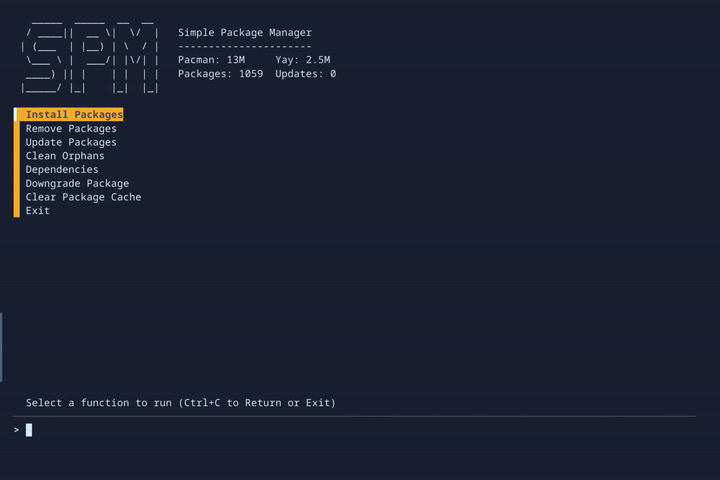

# SPM - Simple Package Manager



A TUI wrapper for pacman and yay that makes package management visual and interactive.

## What It Does

SPM replaces command-line package management with an interactive interface. Instead of remembering pacman flags and typing package names, you browse, search, and select packages visually with real-time information previews.

### Why Use This?

- **Faster workflow** - Multi-select and batch operations beat typing package names repeatedly
- **Better decisions** - See package details, dependencies, and file lists before installing or removing
- **Less mistakes** - Visual confirmation and impact preview reduce accidental removals
- **Easier maintenance** - Find orphans, analyze dependencies, and manage cache without memorizing commands

## Key Features

**Cache intelligence** - Automatic background sync keeps package lists current for fast searching

**Visual package browser** - Search and install from all repositories with live package information, descriptions, and dependencies displayed as you navigate

**Built-in downgrade** - Access Arch Linux Archive directly to roll back problematic updates without external tools

**Multiple removal strategies** - Choose between different dependency handling methods depending on what you're removing

**Dependency analysis** - See what depends on what, find orphaned packages, and understand removal impact before you commit

**Hook manager** - View, create, edit, and manage ALPM hooks with full CRUD operations for user hooks and read-only access to system hooks

**Pacnew/Pacsave manager** - Find and resolve .pacnew and .pacsave files with diff previews and bulk actions

**Interactive configuration** - Edit pacman.conf options and manage repositories without opening a text editor

## Installation

```bash
yay -S spm-arch
```

## Usage

Interactive mode:
```bash
spm
```

Direct commands:
```bash
spm -i [package]    # Install
spm -r [package]    # Remove
spm -u              # Update
spm -o              # Clean orphans
spm -d [package]    # Downgrade
spm -c              # Manage cache
spm -H              # Manage ALPM hooks
spm -p              # Manage pacnew/pacsave files
```

## Cache Files and ALPM Hook

SPM uses lightweight cache files in `/var/cache/spm/` to keep the interface responsive. All files are plain text — if any are corrupted or deleted, SPM regenerates them automatically.

| File | Purpose |
|------|---------|
| `header-cache.txt` | Total and explicitly installed package counts for the header display |
| `update-cache.txt` | Number of available updates |
| `detailed-update-cache.txt` | Full list of available updates with version info |
| `package-list-cache.txt` | Pre-sorted list of all available packages (repo + AUR) with install status |

**Systemd timer** (`spm_updates.timer`) — Periodically syncs the package database, checks for updates, and regenerates the package list and header caches in the background.

**ALPM hook** (`spm_header_cache.hook`) — A pacman post-transaction hook that fires after any package install, upgrade, or removal. It refreshes the header cache so package counts stay accurate even when packages change outside of SPM.

## Requirements

- fzf
- yay

## License

GPL-3.0-or-later
